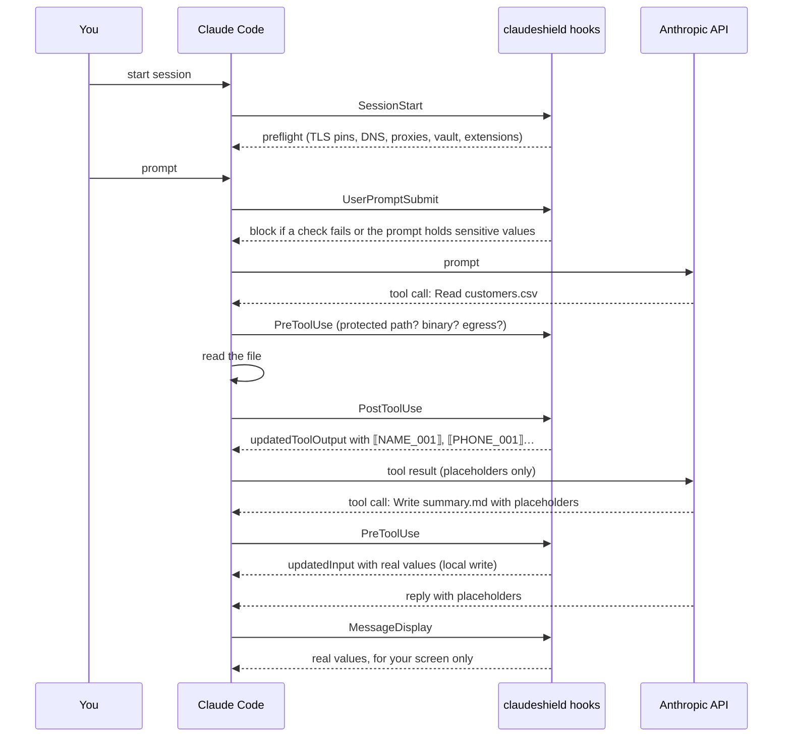

# ClaudeShield

**Hand sensitive files to Claude Code without the sensitive values leaving your machine.**

ClaudeShield is a set of Claude Code hooks plus a small CLI, written in Go with no dependencies. In a folder you mark as sensitive, every name, ID number, phone number, e-mail and street address, amount, company name and credential in what Claude reads is replaced with a placeholder such as `⟦PHONE_001⟧` before the model sees it. When Claude writes a file or runs a local command, the placeholders are swapped back, so the files on your disk hold real data while the conversation sent to Anthropic holds only placeholders. Around that core it checks, before every session, that your connection to Anthropic has not been redirected or intercepted, keeps Claude Code's transcripts in an AES-256 encrypted disk image, refuses commands that would send data to hosts you have not allowed, and blocks extensions (plugins, MCP servers, hooks) you have not approved.

[繁體中文說明](README.zh-TW.md) · [Design](docs/DESIGN.md) · [導讀（給初學者）](docs/導讀.zh-TW.md)

Not affiliated with Anthropic. macOS first (the vault uses `hdiutil`); the hooks and CLI also build and test on Linux.

## What it looks like

This is the output of [`scripts/e2e.sh`](scripts/e2e.sh), which drives the real Claude Code CLI (v2.1.287, Haiku) in a throwaway sensitive workspace holding a fake customer list:

```text
== 1. summarise the customer file (model: haiku)
  --- Claude's answer
  | Here's the full contents of **summary.md**:
  |
  | ⟦NAME_001⟧, ⟦PHONE_001⟧, ⟦EMAIL_001⟧
  | ⟦NAME_002⟧, ⟦PHONE_002⟧, ⟦EMAIL_002⟧
  | ⟦NAME_003⟧, ⟦PHONE_003⟧, ⟦EMAIL_003⟧
  | Total: ⟦AMOUNT_004⟧
  PASS Claude's answer contains no real values
  --- summary.md on disk
  | 王小明, 0912-345-678, wang@acme-holdings.com.tw
  | 陳美玲, 0987-654-321, chen.ml@example-mail.tw
  | 林志豪, 0933-111-222, lin@zh-trading.com.tw
  | Total: NT$174300
  PASS summary.md on disk holds the real values
  PASS total computed on real numbers (174,300)
  PASS conversation records in the saved transcript contain no real values
== 2. send data to a host that is not on the allowlist
  PASS the outbound POST was refused by claudeshield
== 3. paste a national ID into the prompt
  PASS prompt with a national ID was blocked
  PASS events.log has no values
E2E: all checks passed
```

Claude read a CSV it only ever saw as placeholders, wrote a Python script, and the script ran locally on the real numbers. With the `MessageDisplay` hook installed, your own terminal shows the reply with real values; the model and the transcript keep the placeholders.

`claudeshield check` on the machine this was built on:

```text
ClaudeShield safety check  2026-10-02 06:28
! WARN   Remote-desktop or screen-sharing software is running
         parsecd
         Anyone connected sees the conversation on your screen; masking cannot hide what your own screen shows.
✓ OK     No system proxy
✓ OK     No user-added trusted root certificates
✓ OK     No packet capture in progress
✓ OK     api.anthropic.com resolves inside Anthropic's ranges
✓ OK     api.anthropic.com certificate chain matches the pinned roots (GlobalSign Root CA)
✓ OK     Consumer account (claude_max) under consumer terms
```

## Why

TLS already protects the connection from someone sniffing Wi-Fi. The realistic ways sensitive data escapes when you use an AI coding agent are elsewhere:

| Risk | What ClaudeShield does |
| --- | --- |
| The data itself reaches the provider and sits in its logs (retention depends on your account: 30 days, or 5 years on a consumer account with "Help improve Claude" on) | Masks values before the model sees them; checks the account type and, on consumer plans, requires you to confirm the training switch is off |
| Traffic is redirected: `ANTHROPIC_BASE_URL` or a proxy set in your shell, a dotfile, or a cloned repo's `.claude/settings.json` | Preflight finds redirects in the environment and every settings scope, and blocks |
| TLS interception by a root certificate installed on the Mac (managed devices, some antivirus) | Verifies `api.anthropic.com`'s chain against pinned roots, ignoring the system trust store; checks DNS answers and the peer address against Anthropic's published ranges |
| Plaintext transcripts on disk (`~/.claude/projects`, `file-history`, `history.jsonl`) | Moves them into an encrypted sparse bundle; when it is closed, the symlinks dangle into root-owned `/Volumes` so nothing can be written in plaintext |
| A command or prompt injection sends data out (`curl -d`, `scp`, DNS lookups of made-up names, `git push`, `gh gist create`) | Analyses every shell command for outbound data, refuses expanding placeholders into network commands, and turns on Claude Code's OS sandbox in sensitive workspaces |
| A plugin update or a cloned repo adds a hook or MCP server that sees your conversations | Inventories every extension with content hashes and blocks until you approve changes |

## Install

Requires Go 1.24+ to build.

```sh
git clone https://github.com/useless-husband/claudeshield && cd claudeshield
make build
./claudeshield install          # copies itself to ~/.claudeshield/bin and adds hooks to ~/.claude/settings.json
claudeshield check              # see where you stand
claudeshield vault create       # AES-256 encrypted image for transcripts
# close every Claude Code window (and the desktop app), then:
claudeshield vault migrate
```

Mark a folder as sensitive and list the names no pattern can guess:

```sh
cd ~/work/clients
claudeshield init               # writes .claudeshield.json and turns on the sandbox for this folder
$EDITOR .claudeshield.json      # "terms": {"CLIENT": ["Acme Holdings"], "PROJECT": ["Falcon"]}
claudeshield account confirm    # consumer plans only: confirm "Help improve Claude" is off
```

Optionally, check before every launch: add `eval "$(claudeshield shell-init)"` to `~/.zshrc`, which makes `claude` run `claudeshield run`, which refuses to start Claude Code while a check fails. The hooks enforce the same checks from inside a session, so this is a second layer, not the only one.

`claudeshield uninstall` removes the hooks and the environment variables it added; your vault and settings stay.

## How it works



The pieces, each in its own package:

- **`detect`** finds sensitive values: credentials by vendor format, Taiwan national IDs and resident certificates (with check digit), UBNs (統一編號, with checksum), card numbers (Luhn), mobile and landline numbers, street addresses, e-mail, amounts with currency markers, company names, CSV/TSV/Markdown columns whose header names a sensitive field, name lists (`出席：王小明、陳美玲`), names before titles (`陳美玲小姐`), and your own term list. A *Basic* profile with only high-confidence credentials runs in every session; *Strict* runs in sensitive workspaces.
- **`tokenmap`** keeps the value↔placeholder table: deterministic (the same value always gets the same placeholder), persisted with `flock` and atomic replace because hooks run as parallel processes, and stored inside the vault. Every value it has ever masked is matched again by an Aho–Corasick automaton, so a name found next to `客戶：` stays masked when it later appears alone.
- **`hook`** implements SessionStart, UserPromptSubmit, PreToolUse, PostToolUse and MessageDisplay.
- **`egress`** contains a small shell lexer (quotes, substitutions, here-documents) and per-program rules that separate fetching from sending.
- **`preflight`**, **`audit`**, **`vault`**, **`settings`**: the checks, the extension baseline, the encrypted image, and the settings editor.

## What was verified, and how

Everything below was run on this machine against Claude Code v2.1.287; the commands are in the repo.

- `updatedInput` from a PreToolUse hook is applied even without a `permissionDecision`, and Claude Code then runs its normal permission flow against the rewritten input (`probe` in [docs/DESIGN.md](docs/DESIGN.md#verified-platform-behaviour)).
- `updatedToolOutput` from PostToolUse replaces what Claude sees for `Read` and `Bash`, and the saved transcript stores the replaced version (`scripts/e2e.sh`).
- PostToolUseFailure can neither rewrite a failed command's output nor stop the turn (`"continue": false` is ignored there), and Claude Code's Bash tool rejects `trap` and cannot pre-check `{ }` groups or `$?`. ClaudeShield therefore wraps commands only in workspaces whose sandbox auto-allows every command, and returns `allow` there; see [the design notes](docs/DESIGN.md#the-failed-command-problem).
- A real AES-256 sparse bundle is created, refused with a wrong password, contains no plaintext marker after writes, and once closed, writing through a migrated link fails (`make vault-test`, also run in CI on macOS).
- A chain from a self-made "inspection CA" is rejected and the captured Anthropic chain is accepted (`internal/preflight`).

`go test ./...` runs 104 tests, 3 fuzz targets with seed corpora, and property tests with fixed seeds (mask→unmask round trip over 5,000 random documents; six processes writing one token table concurrently; Aho–Corasick against naive search). Detector coverage is 93%.

## Performance

Apple M5 (10 cores), macOS 27, a machine shared with other build jobs. `make bench` and `make bench-hook`.

| Measurement | Result |
| --- | --- |
| Detector, Basic profile, 100 KB mixed text | 0.86 ms (119 MB/s) |
| Detector, Strict profile, 100 KB mixed text | 10.7 ms (9.6 MB/s) |
| Strict, same text, with 2,000 previously seen values to re-match | 10.9 ms |
| Hook process, PreToolUse on `ls` | p50 3.7 ms, p95 4.3 ms |
| Hook process, PostToolUse on a 100 KB source file (ordinary folder) | p50 5.5 ms, p95 5.9 ms |
| Hook process, PostToolUse on a 100 KB, ~2,000-row customer CSV (workspace) | p50 78 ms, p95 80 ms |

Per-line literal prefilters before each regular expression, and Aho–Corasick for remembered values, took the Strict detector from 97 ms to 10.7 ms and the CSV case from 227 ms to 78 ms. The remaining time in the CSV case is mostly reading and rewriting a token table with thousands of entries.

## Limitations

Read these before trusting it with anything.

- **Detection is pattern-based.** A name in free prose with no label, title, list or table around it is not found unless you put it in `terms`. Two-character names are not guessed. Amounts need a currency marker, a labelled field or a column header. Numbers your scripts compute and print without a marker (a total, an average) are visible to Claude: the source rows stay masked, the aggregate does not.
- **Images, PDFs and Office files are refused, not masked**, inside sensitive workspaces. Convert them to text first (`textutil -convert txt file.docx`, `pdftotext file.pdf`).
- **`@file` mentions bypass tools**, so ClaudeShield refuses prompts with `@` references to existing files in sensitive workspaces and asks you to say "read file.txt" instead.
- **Failed commands outside a sandboxed workspace are not masked.** Claude Code gives hooks no way to change a failed command's output. Inside a workspace set up by `claudeshield init`, commands are wrapped so failures go through masking; a command that itself calls `exit` still escapes the wrapper.
- **Transcripts still hold real values in one place.** Claude Code stores each hook's raw output in the session transcript, and the PreToolUse output that expands placeholders for a local write contains the real values. Claude does not receive them, but they are on disk: that is what the vault is for. Without a vault, a sensitive workspace refuses to start unless you acknowledge it.
- **The hook process must be present.** If the binary is deleted, Claude Code treats the hook as failing to start and carries on. `claudeshield check` and `claudeshield run` detect a missing binary; a session started without them does not.
- **Shell analysis is best effort.** A determined command can hide where it connects (variables built at run time, interpreters reading scripts from files). Outside a sensitive workspace that analysis is the only egress control; inside one, Claude Code's OS sandbox enforces the network allowlist. Domain fronting through an allowed host is a known gap of that sandbox too.
- **It cannot change provider-side retention.** Masking limits what reaches Anthropic; how long Anthropic keeps what does reach it is set by your account's terms. For a commercial account with zero data retention, talk to Anthropic.
- **Your own screen** shows real values (by design, via MessageDisplay). Preflight warns about running remote-desktop tools but cannot see a camera.
- `hdiutil attach -nobrowse` is deprecated on macOS 27, so the vault volume is visible in Finder while open.

## Related work

To my knowledge no other tool combines masking with connection checks, an encrypted transcript store and an extension audit for Claude Code, but each piece has neighbours:

- [mask2ai](https://github.com/serkankorkut/mask2ai) is the closest: a Claude Code plugin that masks PII in tool output, restores placeholders in tool input, blocks prompts with PII, and restores values on screen with MessageDisplay (ClaudeShield borrowed that last idea). It targets Turkish formats; it does not address failed-command output, egress, the connection, transcripts at rest or extensions.
- [redact-hook](https://github.com/SilentAutomaton/redact-hook) and [GitGuardian ggshield's AI hook](https://github.com/GitGuardian/ggshield/pull/1480) redact or withhold secrets in tool output, one-way (no placeholders to restore).
- [LLM Guard](https://github.com/protectai/llm-guard)'s Anonymize/Deanonymize scanners and [Microsoft Presidio](https://github.com/microsoft/presidio) provide reversible PII anonymisation for LLM applications in general, with NER models; ClaudeShield uses patterns and checksums instead, to stay a single fast binary that runs on every tool call.
- Claude Code's own [sandbox](https://code.claude.com/docs/en/sandboxing) and [permission rules](https://code.claude.com/docs/en/permissions) provide the OS-level enforcement ClaudeShield builds on; ClaudeShield adds content-aware decisions on top.

## Build and test

```sh
make build        # ./claudeshield
make test         # unit, integration and property tests
make race         # with the race detector
make lint         # gofmt, go vet, staticcheck
make fuzz         # 30 s per fuzz target
make vault-test   # real encrypted images (macOS)
make e2e          # real Claude Code CLI; needs a logged-in `claude`, uses a little Haiku usage
make bench bench-hook
```

MIT licensed.
